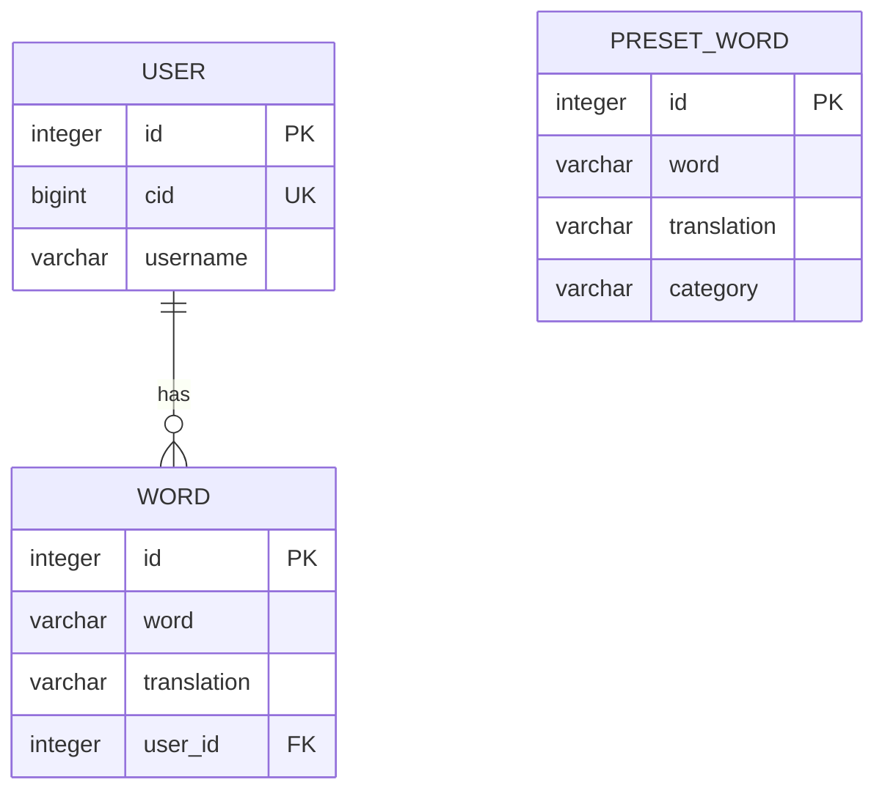

# English Word Trainer Bot 📚


Telegram-бот для эффективного изучения английских слов. Создайте персональный словарь, пополняйте его словами из готовых тематических сборников и тренируйте запоминание с помощью интерактивной викторины.

## ✨ Особенности

- **Персональный словарь:** У каждого пользователя своя изолированная база слов
- **Интеллектуальная тренировка:** Режим викторины с пошаговым выбором перевода
- **Готовые сборники:** Быстрое добавление слов по темам (IT, Путешествия, Базовый уровень)
- **Управление словарем:** Легкое добавление и удаление слов и переводов
- **Дружелюбный интерфейс:** Интуитивное меню с понятной навигацией

## 🛠 Технологический стек

- **Язык:** Python 3
- **Telegram API:** pyTelegramBotAPI (Telebot)
- **База данных:** PostgreSQL
- **ORM:** SQLAlchemy 2.0
- **Конфигурация:** python-dotenv

## 🗄 Архитектура проекта

```
english_bot/
├── main.py                 # Точка входа и основная логика
├── bot/
│   ├── handlers.py         # Обработчики команд и сообщений
│   ├── keyboard.py         # Генерация клавиатур
│   ├── utils_bot.py        # Утилиты бота
│   └── __init__.py
├── db/
│   ├── models.py           # Модели базы данных
│   ├── preset_words.py     # Начальные данные (сборники слов)
│   ├── utils_db.py         # Работа с базой данных
│   └── __init__.py
├── core/
│   └── config.py           # Конфигурация приложения
├── requirements.txt        # Зависимости
└── README.md               # Документация
```

## 📊 Структура базы данных



1. **Пользователь (USER)** - Хранит информацию о пользователях Telegram
2. **Слово (WORD)** - Личный словарь пользователя с привязкой к пользователю
3. **Сборник слов (PRESET_WORD)** - Общие наборы слов по категориям

## 🎯 Основные функции

### 1. Начало работы
Запустите бота командой `/start` для регистрации и перехода в главное меню.


### 2. Добавление слов

**Свои слова:**
- Выберите "➕ Добавить слово"
- Введите слово на английском
- Введите его перевод


**Готовые сборники:**
- Выберите "📚 Сборники слов"
- Выберите тему (например, "Travel")
- Нажмите "Добавить ✅" для копирования слов в свой словарь


### 3. Тренировка

- Выберите "🎮 Тренировка"
- Бот покажет слово на английском
- Выберите правильный перевод из 4 вариантов
- При ошибке неправильный вариант исчезает, давая шанс угадать снова


### 4. Управление словарем

- Выберите "🗑 Удалить слово"
- Введите слово, которое хотите удалить
- Выберите конкретный перевод для удаления


## 🚀 Планы по развитию

- [x] **Базовая функциональность** - Реализовано
- [ ] **Статистика обучения** - Отслеживание прогресса по каждому слову
- [ ] **Интервальное повторение** - Умный алгоритм повторения слов
- [ ] **Дополнительные режимы** - Перевод с русского, вставка в контекст

---
**Автор:** Полулях Оксана
**Создано:** 2025
